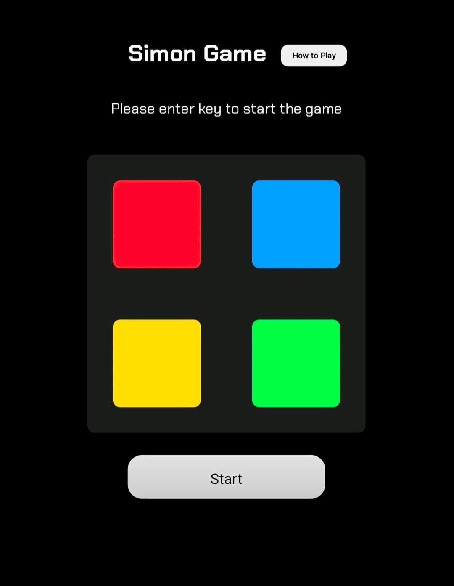

# Simon Game  

A fun and interactive **memory-based game** where players must repeat an ever-growing sequence of lights. Built using **HTML, CSS, and JavaScript**.

🔗 **Live Demo:** [Play Now](https://sepuripavan.github.io/Simon-game/)

---

##  About the Game  
Simon Game is a classic memory challenge where:  
-> The game starts with a single random color flashing.  
-> Players must click the correct sequence to proceed.  
-> With each correct round, the sequence grows longer!  
-> A wrong move resets the game.  

---

##  Technologies Used  
 **HTML** – Page structure  
 **CSS** – Styling & animations  
 **JavaScript** – Game logic & interactivity  

---

##  Screenshot  

<p align="center">
  
</p> 

---

##  How to Run Locally  

To run the Simon Game on your local system, follow these steps:  

1.  Clone the project
```bash
git clone https://link-to-project   
```
2.  Go to the project directory
```bash
cd Simon-game 
```
## Documentation
[Click Here](https://sepuripavan.github.io/Simon-game/#/?id=features)
